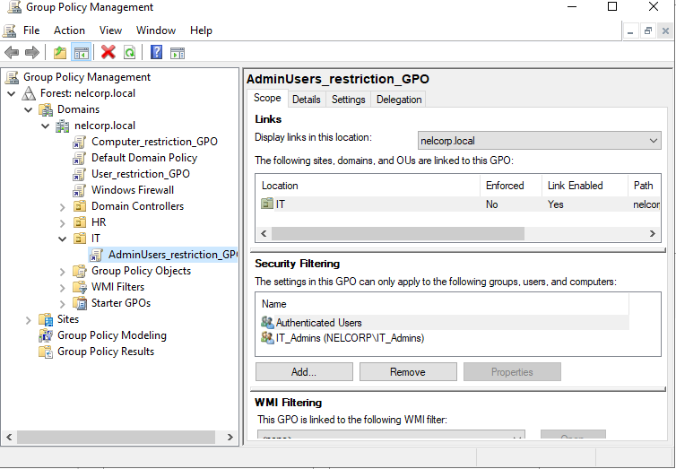

# Windows Active Directory Domain Security Lab 🖥️

**Author:** Nelson R. Acevedo | Cybersecurity Student  
**Date:** January 2026

---

## Project Overview
This lab demonstrates the deployment and hardening of a Windows Active Directory domain in a virtualized environment.  
It simulates a small enterprise with centralized user management, Group Policy enforcement, access control, and security monitoring.

---

## Key Skills Demonstrated
- Created a Windows Domain and joined a Windows 11 client
- Configured OU structure via active directory: IT, HR, Users  
- Configured Group Policies and security measures
- Set up secure file shares with NTFS and Share permissions
- Monitored user activity using Audit logs
- Troubleshot DNS and GPO issues 

---

## Tools & Technologies
- VMware Workstation  
- Windows Server 2022  
- Windows 11 Client  
- Active Directory Domain Services (AD DS)  
- DNS, Group Policy Management

---

## Relevance to Help Desk
This project demostrates skills important for helpdesk, such as:
- Creating and managing domain user accounts
- Troubleshooting domain join and DNS issues
- Configuring and validating Group Policy settings
- Managing file access permissions using security groups
- Monitoring login activity and investigating user issues
 
---

## 📄 Full Lab Report
For detailed setup, screenshots, and step-by-step instructions, download the full lab report:  
[Documentation/Active-Directory-Lab-Report.pdf](Documentations/Active-Directory-Lab-Report.pdf)

---

## Screenshots
*OU Structure*  
  
*Group Policies*  

